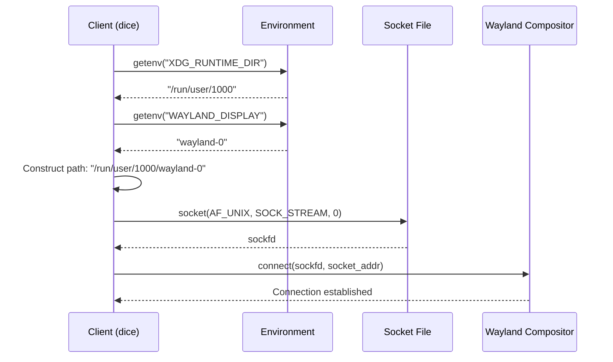
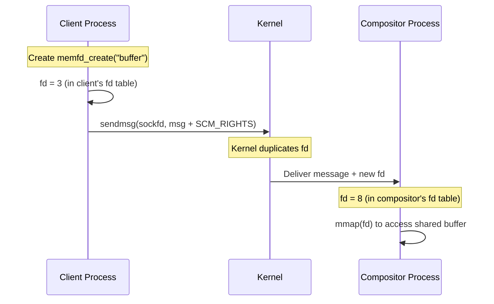

## Overview

Wayland clients communicate with the compositor using **Unix domain sockets** - a fast, reliable IPC (Inter-Process Communication) mechanism for processes on the same machine.

<Info>
Unix domain sockets are similar to TCP sockets but optimized for local communication, offering better performance and the ability to pass file descriptors between processes.
</Info>

## Why Unix Domain Sockets?

Wayland chose Unix domain sockets for several key reasons:

1. **High Performance**: Lower overhead than network sockets (no protocol stack)
2. **File Descriptor Passing**: Can transfer file descriptors (essential for shared memory)
3. **Security**: File system permissions control access
4. **Reliability**: Guaranteed delivery and ordering (like TCP)
5. **Local Only**: No network exposure

## Connection Establishment

### Finding the Display Socket

The socket path is determined by environment variables:

```c
static char *get_display_path(void) {
  /* Get XDG runtime path */
  char *xdg_runtime_dir_path = getenv("XDG_RUNTIME_DIR");
  if (xdg_runtime_dir_path == NULL) {
    fprintf(stderr, "ERROR: XDG_RUNTIME_DIR is not set: %s\n", strerror(errno));
    return NULL;
  }
  
  /* Get Wayland display name (wayland-0 default) */
  char *wayland_display = getenv("WAYLAND_DISPLAY");
  if (wayland_display == NULL)
    wayland_display = "wayland-0";
  
  /* Construct full display path */
  size_t display_path_len = strlen(xdg_runtime_dir_path) + strlen(wayland_display) + 2;
  char *display_path = malloc(display_path_len);
  snprintf(display_path, display_path_len, "%s/%s", 
           xdg_runtime_dir_path, wayland_display);
  
  return display_path;  // e.g., "/run/user/1000/wayland-0"
}  // dice.c:43-67
```

<Note>
**Typical path**: `/run/user/1000/wayland-0` where `1000` is your user ID.
</Note>

### Creating and Connecting the Socket

```c
static int open_display_connection(void) {
  char *path = get_display_path();
  if (path == NULL) {
    fprintf(stderr, "ERROR: Failed in retrieving display path: %s\n", strerror(errno));
    return 1;
  }
  
  /* Create Unix domain socket */
  int sockfd = socket(AF_UNIX, SOCK_STREAM, 0);
  if (sockfd == -1) {
    fprintf(stderr, "ERROR: Socket creation failed: %s\n", strerror(errno));
    free(path);
    return -1;
  }
  
  /* Configure socket connection */
  struct sockaddr_un socket_addr;
  memset(&socket_addr, 0, sizeof(socket_addr));
  socket_addr.sun_family = AF_UNIX;  // Unix domain socket
  strcpy(socket_addr.sun_path, path);  // Socket file path
  
  int addrlen = sizeof(socket_addr);
  if (connect(sockfd, (struct sockaddr *)&socket_addr, addrlen) == -1) {
    fprintf(stderr, "ERROR: Failed connection to socket: %s\n", strerror(errno));
    close(sockfd);
    free(path);
    return -1;
  }
  
  fprintf(stderr, "SUCCESS: Successfully connected to sockfd\n");
  free(path);
  return sockfd;
}  // dice.c:70-104
```

### Connection Flow



## Bidirectional Communication

Once connected, the socket provides a **bidirectional byte stream** for sending requests and receiving events.

### Writing Messages

The `write_msg` function sends requests to the compositor:

```c
static int write_msg(int sockfd, struct Request *req) {
  /* Write header */
  if (write(sockfd, &req->header, sizeof(struct Header)) != sizeof(struct Header))
    return -1;
  
  /* Write data if any */
  if (req->data && req->data_len > 0)
    if (write(sockfd, req->data, req->data_len) != req->data_len)
      return -1;
  
  return 0;
}  // dice.c:106-118
```

**Key points**:
- Header is written first (always 8 bytes)
- Data follows immediately (if present)
- Returns -1 on partial write (error condition)

<Tip>
In production code, you should handle partial writes by looping until all data is sent.
</Tip>

### Reading Messages

The `read_msg` function receives events from the compositor:

```c
static int read_msg(int sockfd, struct Request *req) {
  ssize_t bytes_read = read(sockfd, &req->header, sizeof(struct Header));
  if (bytes_read == -1) {
    perror("read");
    return -1;
  }
  if (bytes_read < sizeof(struct Header)) {
    fprintf(stderr, "Unexpected EOF while reading header\n");
    return -1;
  }
  
  // Check if there's additional data beyond the header
  if (req->header.size > sizeof(struct Header)) {
    req->data_len = req->header.size - sizeof(struct Header);
    req->data = malloc(req->data_len);
    
    bytes_read = read(sockfd, req->data, req->data_len);
    if (bytes_read == -1 || bytes_read < req->data_len) {
      perror("read data");
      free(req->data);
      req->data = NULL;
      return -1;
    }
  } else {
    req->data = NULL;
    req->data_len = 0;
  }
  
  return 0;
}  // dice.c:120-148
```

**Reading process**:
1. Read the 8-byte header
2. Check `header.size` to determine if there's additional data
3. If `size > 8`, allocate and read the remaining `size - 8` bytes
4. Return the complete message

<Note>
The caller is responsible for `free()`ing `req->data` when done with the message.
</Note>

## File Descriptor Passing

One of Unix domain sockets' most powerful features is **passing file descriptors** between processes. Wayland uses this for shared memory.

### Sending a File Descriptor

The `create_shm_pool` function passes a file descriptor for shared memory:

```c
static uint32_t create_shm_pool(int sockfd, int fd, size_t size) {
  uint32_t pool_id = wl_id++;
  
  struct Header header = {
    .object_id = wl_shm_id,
    .opcode = 0,  // wl_shm::create_pool
    .size = sizeof(struct Header) + 8,
  };
  
  uint32_t data[2] = {pool_id, (uint32_t)size};
  
  /* Sending the file descriptor - fd */
  struct msghdr msg = {0};
  struct cmsghdr *cmsg;
  char control[CMSG_SPACE(sizeof(int))];
  struct iovec iov[2];
  
  // Set up scatter-gather I/O for header and data
  iov[0].iov_base = &header;
  iov[0].iov_len = sizeof(header);
  iov[1].iov_base = data;
  iov[1].iov_len = sizeof(data);
  
  msg.msg_iov = iov;
  msg.msg_iovlen = 2;
  msg.msg_control = control;  // Control message buffer
  msg.msg_controllen = sizeof(control);
  
  // Attach file descriptor to control message
  cmsg = CMSG_FIRSTHDR(&msg);
  cmsg->cmsg_level = SOL_SOCKET;
  cmsg->cmsg_type = SCM_RIGHTS;  // File descriptor passing
  cmsg->cmsg_len = CMSG_LEN(sizeof(int));
  *(int *)CMSG_DATA(cmsg) = fd;  // The actual file descriptor
  
  if (sendmsg(sockfd, &msg, 0) < 0) {
    fprintf(stderr, "ERROR: Failed to send SHM pool creation request: %s\n",
            strerror(errno));
    return 0;
  }
  
  return pool_id;
}  // dice.c:295-335
```

### File Descriptor Passing Diagram



<Info>
**SCM_RIGHTS** allows passing file descriptors through Unix sockets. The kernel duplicates the file descriptor into the receiving process's fd table.
</Info>

### Why This Matters

File descriptor passing enables **zero-copy buffer sharing**:

1. Client creates a shared memory file descriptor:
   ```c
   int fd = memfd_create("buffer", MFD_CLOEXEC);  // dice.c:274
   ftruncate(fd, buffer_size);
   ```

2. Client maps it into its address space:
   ```c
   void *data = mmap(NULL, size, PROT_READ | PROT_WRITE, MAP_SHARED, fd, 0);
   // dice.c:287
   ```

3. Client writes pixel data:
   ```c
   uint32_t *pixels = (uint32_t *)data;
   pixels[i] = (r << 16) | (g << 8) | b;  // dice.c:510
   ```

4. Client passes fd to compositor via `sendmsg`

5. Compositor maps the **same memory** and can read pixels directly - no copying!

## Message Flow Example

Here's how a complete request-response cycle works:

```c
// In main loop
while (1) {
  struct Request msg = {0};
  if (read_msg(sockfd, &msg) != 0) {
    fprintf(stderr, "ERROR: Failed to read msg\n");
    break;
  }
  
  printf("\nMessage Header:\n");
  printf(" - ObjectID: %u\n", msg.header.object_id);
  printf(" - Opcode: %u\n", msg.header.opcode);
  printf(" - Size: %u\n", msg.header.size);
  
  // Handle ping from xdg_wm_base
  if (msg.header.object_id == xdg_wm_base_id && msg.header.opcode == 0) {
    // Send pong response
    struct Request req = {
      .header = {
        .object_id = xdg_wm_base_id,
        .opcode = 1,  // xdg_wm_base::pong
        .size = sizeof(struct Header) + sizeof(uint32_t),
      },
      .data = msg.data,  // Echo back the serial number
      .data_len = sizeof(uint32_t),
    };
    write_msg(sockfd, &req);
  }
  
  if (msg.data)
    free(msg.data);
}  // dice.c:516-555 (simplified)
```

## Socket Properties

### Stream-Oriented

Unix domain sockets with `SOCK_STREAM` provide:
- **Reliable delivery**: No lost messages
- **Ordered delivery**: Messages arrive in send order
- **Connection-oriented**: Must establish connection first
- **Byte stream**: No message boundaries (must parse headers)

### Performance Characteristics

- **Zero-copy** for file descriptor passing
- **Kernel-buffered** for smooth communication
- **Blocking I/O** in dice (simpler, but consider `poll()` or `epoll` for production)

<Tip>
For a responsive GUI application, use non-blocking I/O or event loops (like `libwayland`'s `wl_event_loop`).
</Tip>

## Error Handling

Common socket errors:

| Error | Meaning | Solution |
|-------|---------|----------|
| `ENOENT` | Socket file doesn't exist | Compositor not running |
| `ECONNREFUSED` | Connection refused | Check compositor status |
| `EPIPE` | Broken pipe | Compositor crashed or closed connection |
| `EAGAIN` | Would block | Use non-blocking I/O or retry |

## Key Takeaways

- **Unix domain sockets**: Fast, secure IPC for local communication
- **Connection-oriented**: Client connects to compositor's socket file
- **Bidirectional**: Both sides can send and receive simultaneously
- **File descriptor passing**: Enables zero-copy shared memory with `SCM_RIGHTS`
- **Stream socket**: Reliable, ordered byte stream (like TCP)
- **Environment-based discovery**: `$XDG_RUNTIME_DIR/$WAYLAND_DISPLAY`

## Next Steps

<CardGroup cols={2}>
  <Card title="Wayland Protocol" icon="diagram-project" href="/concepts/wayland-protocol">
    Learn about the object-oriented protocol
  </Card>
  <Card title="Wire Protocol" icon="binary" href="/concepts/wire-protocol">
    Understand the binary message format
  </Card>
</CardGroup>