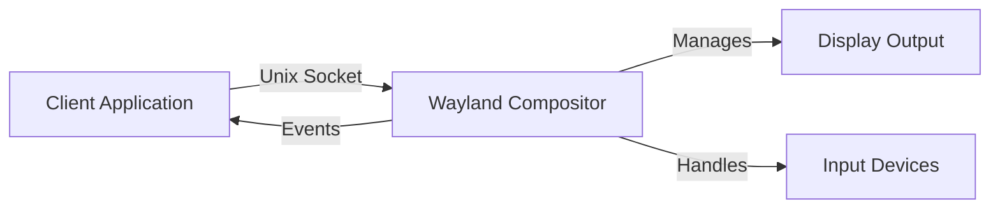

## Overview

Wayland is a modern display server protocol that uses a client-server architecture. Unlike X11, Wayland is built around a simple, object-oriented protocol where clients communicate directly with the compositor using typed interfaces.

## Client-Server Model

In Wayland, the **compositor** acts as the display server, managing windows, input, and rendering. Applications act as **clients** that request services from the compositor.



<Note>
Every Wayland client communicates with the compositor over a Unix domain socket, typically located at `$XDG_RUNTIME_DIR/$WAYLAND_DISPLAY` (e.g., `/run/user/1000/wayland-0`).
</Note>

## Object-Oriented Protocol

Wayland uses an **object-oriented** design where:

- Every resource is an **object** with a unique ID
- Objects have **interfaces** that define their methods (requests) and events
- Clients send **requests** to objects
- The compositor sends **events** back to clients

### Object IDs

Each object in a Wayland session has a unique 32-bit identifier:

```c
static const uint32_t wl_display_object_id = 1;  // dice.c:18
static uint32_t wl_compositor_id = 0;
static uint32_t wl_shm_id = 0;
static uint32_t xdg_wm_base_id = 0;
static uint32_t wl_id = 3;  // Counter for new objects
```

<Info>
Object ID 1 is always reserved for `wl_display`, the root object that represents the connection itself.
</Info>

## The Registry Pattern

Wayland uses a **registry** mechanism to discover available global objects (interfaces provided by the compositor).

### Step 1: Request the Registry

The client requests the registry from `wl_display`:

```c
uint32_t registry_id = 2;
struct Request req = {
    .header = {
        .object_id = wl_display_object_id,  // Target: wl_display (ID 1)
        .opcode = 1,                         // wl_display::get_registry
        .size = sizeof(struct Header) + sizeof(uint32_t),
    },
    .data = &registry_id,  // New ID for the registry object
    .data_len = sizeof(uint32_t),
};  // dice.c:413-422
```

### Step 2: Receive Global Events

The compositor sends `wl_registry::global` events announcing available interfaces:

```c
if (msg.header.object_id == registry_id && msg.header.opcode == 0) {
    uint8_t *data = (uint8_t *)msg.data;
    uint32_t name = *(uint32_t *)data;
    uint32_t interface_len = *(uint32_t *)(data + 4);
    char *interface = (char *)(data + 8);
    uint32_t padding = (4 - (interface_len % 4)) % 4;
    uint32_t version = *(uint32_t *)(data + 8 + interface_len + padding);
    
    printf("Global Event:\n");
    printf(" - Name: %u\n", name);
    printf(" - Interface: %s\n", interface);  // e.g., "wl_compositor"
    printf(" - Version: %u\n", version);
}  // dice.c:449-460
```

## Interface Binding

 Once a client discovers a global interface, it must **bind** to it to create a local proxy object.

### Binding Process

The `bind_request` function shows how to bind to an interface:

```c
static void bind_request(int sockfd, uint32_t registry_id, uint32_t name,
                         const char *interface, uint32_t version,
                         uint32_t new_id) {
    size_t interface_len = strlen(interface) + 1;
    size_t padding = (4 - (interface_len % 4)) % 4;
    size_t data_size = 4 + 4 + interface_len + padding + 4 + 4;
    uint8_t *data = malloc(data_size);

    *(uint32_t *)(data) = name;                              // Global name
    *(uint32_t *)(data + 4) = interface_len;                 // String length
    memcpy(data + 8, interface, interface_len);              // Interface name
    memset(data + 8 + interface_len, 0, padding);            // Padding
    *(uint32_t *)(data + 8 + interface_len + padding) = version;
    *(uint32_t *)(data + 8 + interface_len + padding + 4) = new_id;

    struct Request req = {
        .header = {
            .object_id = registry_id,
            .opcode = 0,  // wl_registry::bind
            .size = sizeof(struct Header) + data_size,
        },
        .data = data,
        .data_len = data_size,
    };
    write_msg(sockfd, &req);
    free(data);
}  // dice.c:150-183
```

<Tip>
Binding requires proper alignment and padding of string data to 4-byte boundaries, as required by the Wayland wire protocol.
</Tip>

### Common Interfaces

Dice binds to three essential interfaces:

1. **`wl_compositor`** - Creates surfaces (windows/buffers)
2. **`wl_shm`** - Shared memory for pixel buffers
3. **`xdg_wm_base`** - Desktop window management (XDG Shell)

```c
if (strcmp(interface, "wl_compositor") == 0) {
    bind_request(sockfd, registry_id, name, interface, version, wl_id);
    wl_compositor_id = wl_id;
    wl_id++, required_interfaces++;
} else if (strcmp(interface, "wl_shm") == 0) {
    bind_request(sockfd, registry_id, name, interface, version, wl_id);
    wl_shm_id = wl_id;
    wl_id++, required_interfaces++;
} else if (strcmp(interface, "xdg_wm_base") == 0) {
    bind_request(sockfd, registry_id, name, interface, version, wl_id);
    xdg_wm_base_id = wl_id;
    wl_id++, required_interfaces++;
}  // dice.c:463-475
```

## Interface Usage Examples

After binding, clients can call methods on the interfaces:

### Creating a Surface

```c
static uint32_t create_surface(int sockfd, uint32_t compositor_id) {
    uint32_t surface_id = wl_id++;

    struct Request req = {
        .header = {
            .object_id = compositor_id,       // Target the compositor
            .opcode = 0,                      // wl_compositor::create_surface
            .size = sizeof(struct Header) + sizeof(uint32_t),
        },
        .data = &surface_id,                  // ID for new surface
        .data_len = sizeof(uint32_t),
    };

    write_msg(sockfd, &req);
    return surface_id;
}  // dice.c:185-206
```

### Committing Surface State

```c
static void wl_surface_commit(int sockfd, uint32_t surface_id) {
    struct Request req = {
        .header = {
            .object_id = surface_id,
            .opcode = 6,  // wl_surface::commit
            .size = sizeof(struct Header),
        },
        .data = NULL,
        .data_len = 0,
    };
    write_msg(sockfd, &req);
}  // dice.c:255-271
```

<Info>
In Wayland, changes to surfaces are **double-buffered**. The `commit` request atomically applies all pending state changes.
</Info>

## Key Concepts

- **Everything is an object**: Surfaces, buffers, keyboards, pointers - all have object IDs
- **Interfaces define behavior**: Each interface (e.g., `wl_surface`) has a set of requests and events
- **Registry for discovery**: Clients discover compositor capabilities through the registry
- **Binding creates proxies**: Binding an interface gives you a local object ID to interact with it
- **Atomic commits**: State changes are batched and applied atomically

## Next Steps

<CardGroup cols={2}>
  <Card title="Wire Protocol" icon="binary" href="/concepts/wire-protocol">
    Learn about the binary message format
  </Card>
  <Card title="Socket Communication" icon="network-wired" href="/concepts/socket-communication">
    Understand Unix socket communication
  </Card>
</CardGroup>