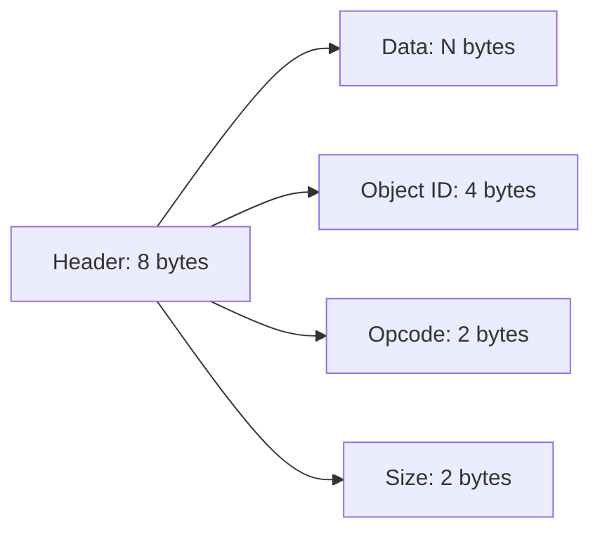

## Overview

The Wayland wire protocol is a **binary protocol** optimized for efficiency. Messages consist of a fixed-size header followed by variable-length data, all transmitted over a Unix domain socket.

<Note>
Unlike text-based protocols (HTTP, JSON-RPC), Wayland uses raw binary data for maximum performance and minimal overhead.
</Note>

## Message Structure

Every Wayland message has the same basic structure:



## The Header Format

Dice defines the header structure at dice.c:24-28:

```c
struct Header {
  uint32_t object_id;  // 4 bytes: Target object
  uint16_t opcode;     // 2 bytes: Method/event to invoke
  uint16_t size;       // 2 bytes: Total message size (header + data)
};  // Total: 8 bytes
```

### Header Fields

| Field | Type | Size | Description |
|-------|------|------|-------------|
| `object_id` | `uint32_t` | 4 bytes | The target object for this message |
| `opcode` | `uint16_t` | 2 bytes | Which method/event to invoke on the object |
| `size` | `uint16_t` | 2 bytes | Total message size including header (8 + data length) |

<Info>
The `size` field includes the 8-byte header itself, so `size = sizeof(Header) + data_len`.
</Info>

## Complete Request Structure

Dice wraps messages in a `Request` structure for convenience:

```c
struct Request {
  struct Header header;  // 8-byte header
  void *data;            // Pointer to variable-length data
  size_t data_len;       // Length of data (for tracking)
};  // dice.c:30-34
```

## Message Examples

### Simple Message (No Data)

Committing a surface requires only a header:

```c
struct Request req = {
    .header = {
        .object_id = surface_id,       // Target surface
        .opcode = 6,                   // wl_surface::commit
        .size = sizeof(struct Header), // Just 8 bytes
    },
    .data = NULL,
    .data_len = 0,
};  // dice.c:256-265
```

**Wire format (8 bytes)**:
```
[object_id: 4] [opcode: 2] [size=8: 2]
```

### Message with Simple Data

Creating a surface passes a single uint32_t (the new surface ID):

```c
uint32_t surface_id = wl_id++;

struct Request req = {
    .header = {
        .object_id = compositor_id,
        .opcode = 0,  // wl_compositor::create_surface
        .size = sizeof(struct Header) + sizeof(uint32_t),  // 8 + 4 = 12
    },
    .data = &surface_id,
    .data_len = sizeof(uint32_t),
};  // dice.c:188-197
```

**Wire format (12 bytes)**:
```
[object_id: 4] [opcode: 2] [size=12: 2] [new_surface_id: 4]
```

### Complex Message with Padding

The `bind_request` demonstrates string serialization with padding:

```c
size_t interface_len = strlen(interface) + 1;  // Include null terminator
size_t padding = (4 - (interface_len % 4)) % 4;  // Pad to 4-byte boundary
size_t data_size = 4 + 4 + interface_len + padding + 4 + 4;

uint8_t *data = malloc(data_size);
*(uint32_t *)(data) = name;                              // Global name
*(uint32_t *)(data + 4) = interface_len;                 // String length
memcpy(data + 8, interface, interface_len);              // String data
memset(data + 8 + interface_len, 0, padding);            // Zero padding
*(uint32_t *)(data + 8 + interface_len + padding) = version;
*(uint32_t *)(data + 8 + interface_len + padding + 4) = new_id;

struct Request req = {
    .header = {
        .object_id = registry_id,
        .opcode = 0,  // wl_registry::bind
        .size = sizeof(struct Header) + data_size,
    },
    .data = data,
    .data_len = data_size,
};  // dice.c:153-173
```

**Wire format example** (binding "wl_shm"):
```
Header (8 bytes):
  [registry_id: 4] [opcode=0: 2] [size=36: 2]

Data (28 bytes):
  [name: 4]              // Global name from compositor
  [str_len=7: 4]         // Length of "wl_shm\0"
  ["wl_shm\0": 7]        // String with null terminator
  [padding: 1]           // Pad to 4-byte boundary (7 % 4 = 3, need 1 byte)
  [version: 4]           // Interface version
  [new_id: 4]            // New object ID for bound interface
```

<Tip>
All multi-byte values are sent in **native byte order** (typically little-endian on modern systems).
</Tip>

## Padding and Alignment

Wayland requires all data to be aligned to **4-byte boundaries**.

### Padding Calculation

```c
size_t padding = (4 - (length % 4)) % 4;
```

**Examples**:
- Length 7: `(4 - (7 % 4)) % 4` = `(4 - 3) % 4` = **1 byte** padding
- Length 8: `(4 - (8 % 4)) % 4` = `(4 - 0) % 4` = **0 bytes** padding
- Length 10: `(4 - (10 % 4)) % 4` = `(4 - 2) % 4` = **2 bytes** padding

<Note>
Padding bytes must be zeroed. This ensures deterministic behavior and prevents information leakage.
</Note>

## Data Types

Wayland supports several primitive types:

| Type | C Type | Size | Description |
|------|--------|------|-------------|
| `int` | `int32_t` | 4 bytes | Signed 32-bit integer |
| `uint` | `uint32_t` | 4 bytes | Unsigned 32-bit integer |
| `fixed` | `int32_t` | 4 bytes | Fixed-point decimal (24.8 format) |
| `string` | char* | Variable | Length (uint32) + data + null + padding |
| `object` | `uint32_t` | 4 bytes | Object ID reference |
| `new_id` | `uint32_t` | 4 bytes | ID for newly created object |
| `array` | Variable | Variable | Length (uint32) + data + padding |
| `fd` | Special | 0 bytes | File descriptor (passed via SCM_RIGHTS) |

## Parsing Incoming Messages

Dice parses registry global events:

```c
if (msg.header.object_id == registry_id && msg.header.opcode == 0) {
    uint8_t *data = (uint8_t *)msg.data;
    
    // Parse fields with proper alignment
    uint32_t name = *(uint32_t *)data;
    uint32_t interface_len = *(uint32_t *)(data + 4);
    char *interface = (char *)(data + 8);
    
    // Calculate padding to find next field
    uint32_t padding = (4 - (interface_len % 4)) % 4;
    uint32_t version = *(uint32_t *)(data + 8 + interface_len + padding);
    
    printf("Global Event:\n");
    printf(" - Name: %u\n", name);
    printf(" - Interface: %s\n", interface);
    printf(" - Version: %u\n", version);
}  // dice.c:449-460
```

## Message Construction Pattern

A typical pattern for building messages:

```c
// 1. Calculate data size (including padding)
size_t data_size = /* calculate based on types */;

// 2. Allocate and populate data buffer
uint8_t *data = malloc(data_size);
/* Write fields with proper offsets */

// 3. Build request with header
struct Request req = {
    .header = {
        .object_id = target_object,
        .opcode = method_number,
        .size = sizeof(struct Header) + data_size,
    },
    .data = data,
    .data_len = data_size,
};

// 4. Send and cleanup
write_msg(sockfd, &req);
free(data);
```

## Creating Complex Messages

Creating a buffer requires multiple integer parameters:

```c
uint32_t buffer_id = wl_id++;
uint32_t data[6] = {buffer_id, 0, width, height, stride, format};

struct Request req = {
    .header = {
        .object_id = pool_id,
        .opcode = 0,  // wl_shm_pool::create_buffer
        .size = sizeof(struct Header) + 24,  // 8 + (6 * 4)
    },
    .data = data,
    .data_len = 24,
};  // dice.c:344-353
```

**Wire format (32 bytes)**:
```
Header: [pool_id: 4] [opcode=0: 2] [size=32: 2]
Data:   [buffer_id: 4] [offset=0: 4] [width: 4] [height: 4] [stride: 4] [format: 4]
```

## Debugging Messages

Dice prints message headers for debugging:

```c
printf("\nMessage Header:\n");
printf(" - ObjectID: %u\n", msg.header.object_id);
printf(" - Opcode: %u\n", msg.header.opcode);
printf(" - Size: %u\n", msg.header.size);  // dice.c:443-446
```

<Tip>
Always validate that `msg.header.size >= sizeof(struct Header)` to prevent buffer underflows.
</Tip>

## Key Takeaways

- **Fixed 8-byte header**: Every message starts with object_id, opcode, and size
- **4-byte alignment**: All data must be padded to 4-byte boundaries
- **Native byte order**: Values use the system's native endianness
- **Size includes header**: The `size` field counts the header itself
- **Strings need padding**: Account for null terminator + alignment
- **Zero the padding**: Prevents undefined behavior and security issues

## Next Steps

<CardGroup cols={2}>
  <Card title="Socket Communication" icon="network-wired" href="/concepts/socket-communication">
    Learn how messages are transmitted over sockets
  </Card>
  <Card title="Wayland Protocol" icon="diagram-project" href="/concepts/wayland-protocol">
    Understanding the object-oriented protocol design
  </Card>
</CardGroup>